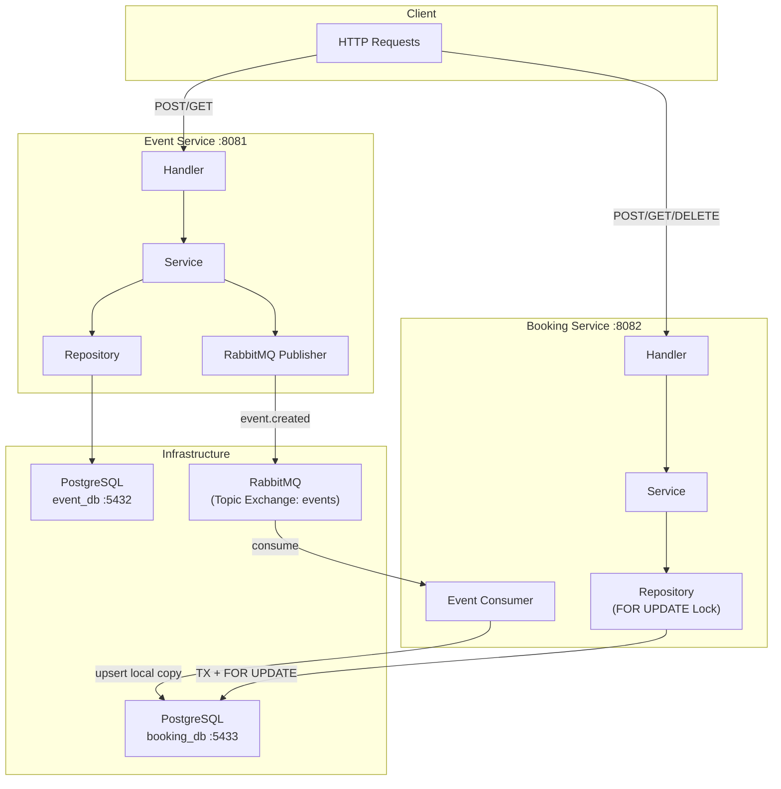
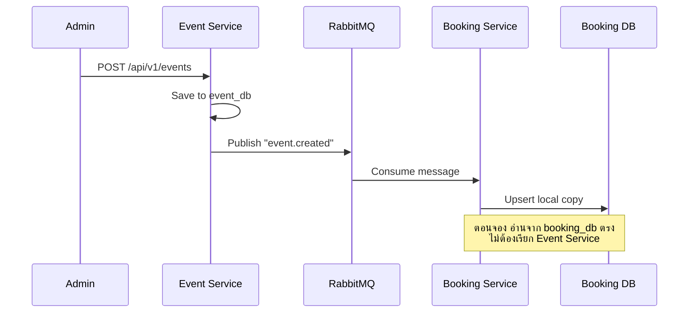
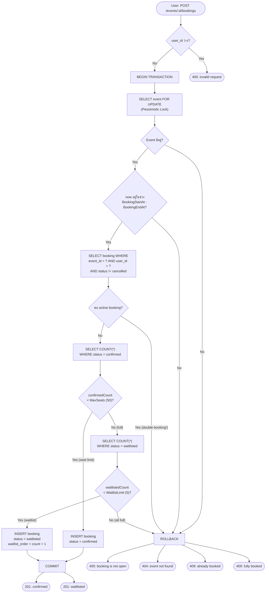
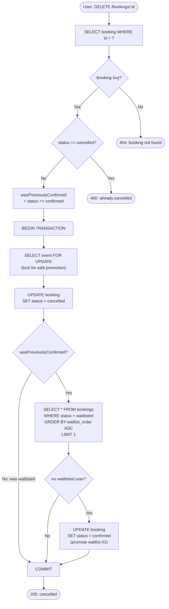
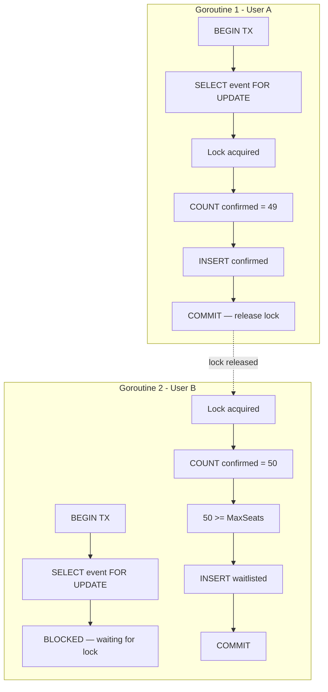
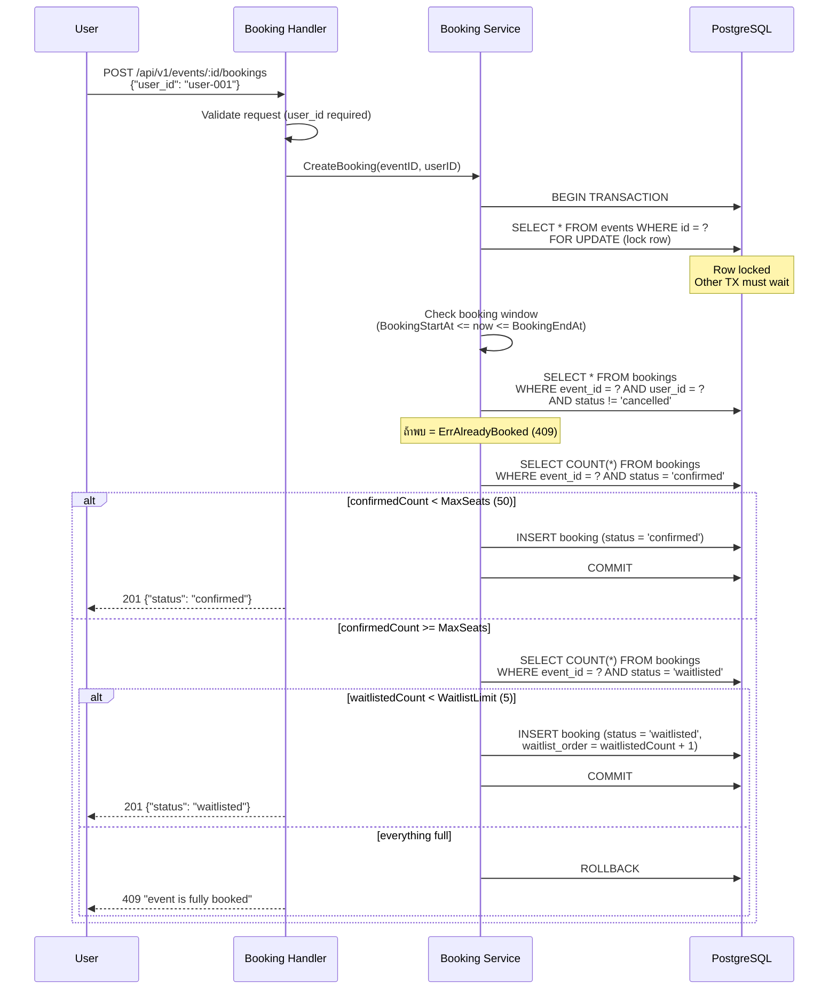
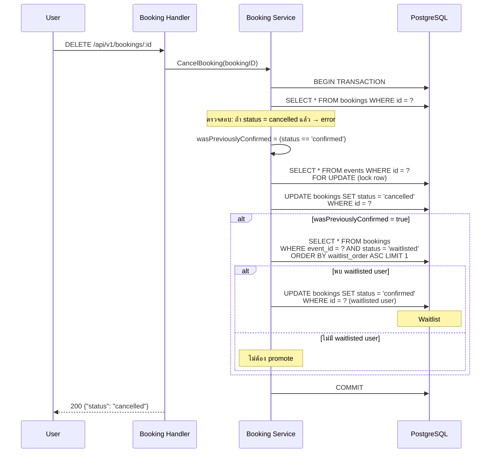
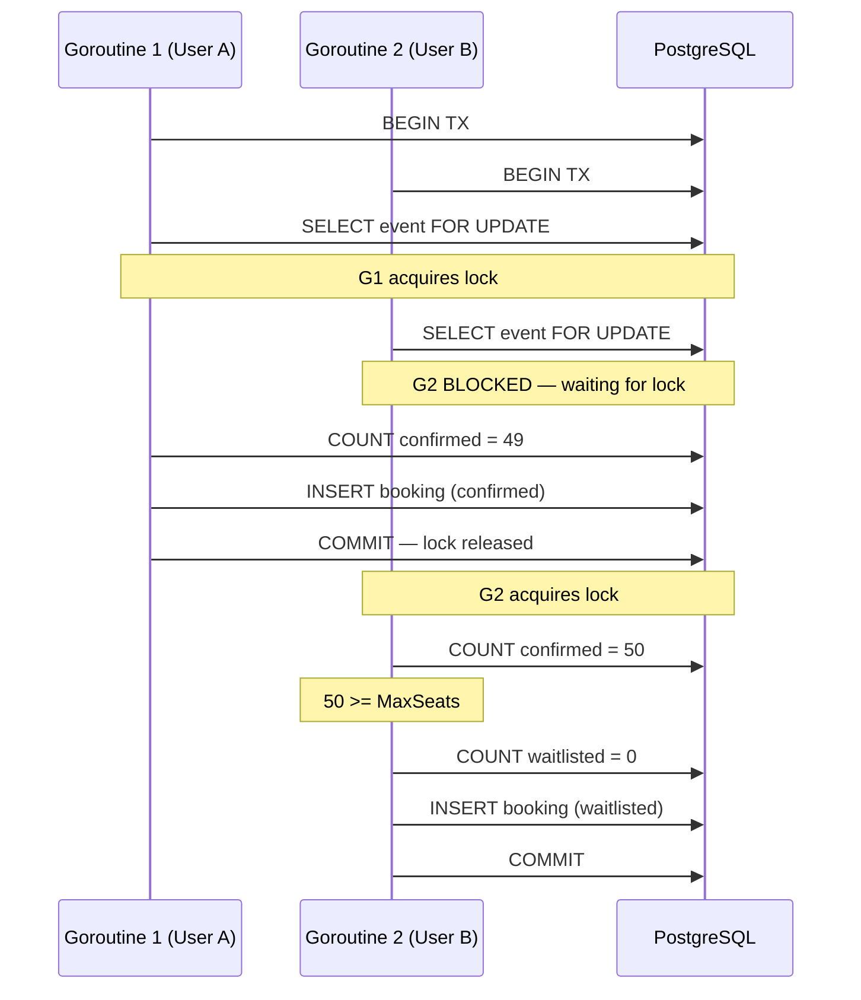
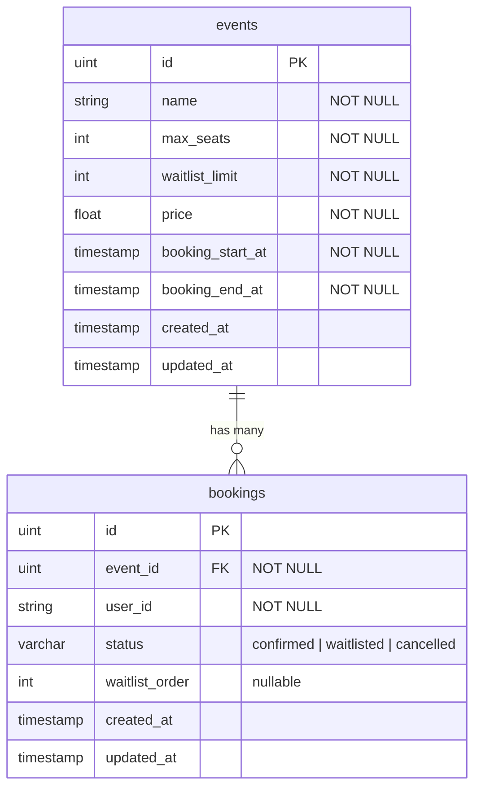

# Booking Microservice — Event Reservation System

ระบบจอง Event แบบ Microservice Architecture รองรับ concurrency สูง พร้อมระบบ Waitlist อัตโนมัติ

> รันคำสั่งเดียว `make build-test` เพื่อ Build + Test ทั้งหมด

## Problem Statement

ออกแบบระบบจอง Event ที่ต้อง:

- จำกัดจำนวนคนที่จองได้ (Max Seats)
- มี Waitlist สำรองคนที่จองไม่ทัน
- รองรับ concurrency สูง (หลาย user จองพร้อมกัน)
- ป้องกัน double-booking (user เดียวจองซ้ำ)
- ป้องกัน race condition (overbooking)

### Event ตัวอย่าง

| Field | Value |
|---|---|
| Event | Golang Workshop Bangkok |
| Max Seats | 50 |
| Waitlist | 5 |
| Price | ฿2,500 |
| Booking Window | 20/2/2026 17:00 - 25/2/2026 17:00 |

## Tech Stack

| Component | Technology |
|---|---|
| Language | Go 1.22+ |
| HTTP Framework | Echo v4 |
| ORM | GORM |
| Database | PostgreSQL 16 |
| Message Queue | RabbitMQ 3.13 |
| Container | Docker Compose |
| Testing | Go testing + testify |

---

## ✅ Quick Summary

### Test Results

| Type | Count | Status |
|------|-------|--------|
| Unit Tests | 28 tests | PASS |
| API E2E Tests | 10 steps | PASS |
| Integration Tests | 6 tests | PASS |
| **Total** | **44 tests** | **ALL PASS** |

### Key Features Implemented

- **Max Seats Limit** - จำกัดจำนวนคนจอง
- **Waitlist System** - คิวสำรอง + Auto-promote
- **Concurrency Protection** - `SELECT ... FOR UPDATE`
- **Double-booking Prevention** - App check + DB constraint
- **Race Condition Prevention** - 3-layer protection
- **Microservices** - 2 services + Message Queue
- **Complete Tests** - Unit + API + Integration

### One Command to Verify

```bash
make build-test
```

---

## Architecture Overview

ระบบแบ่งเป็น 2 microservices แยก database แยก deploy ได้อิสระ สื่อสารผ่าน RabbitMQ:



### ทำไมแยกเป็น 2 Services?

| Concern | การแก้ |
|---|---|
| Event Service ล่ม | Booking Service ยังจองได้ (มี local copy ของ event) |
| แยก deploy | ปรับ scale Booking Service ได้อิสระเมื่อ concurrency สูง |
| แยก DB | ไม่มี cross-service table lock ที่ทำให้ช้า |

### ทำไมใช้ RabbitMQ?

ถ้า Booking Service เรียก Event Service ผ่าน HTTP ทุกครั้งที่จอง:

- Event Service ล่ม = จองไม่ได้ (tight coupling)
- ทุก booking request ต้อง round-trip HTTP = เพิ่ม latency

RabbitMQ แก้ด้วยการ sync ข้อมูล Event แบบ async:



---

## Activity Diagrams

### Create Booking — Activity Diagram

แสดง flow ทั้งหมดของการจอง ครอบคลุมทุก pain point ในโจทย์:



| Pain Point | ตรง step ไหน |
|---|---|
| ป้องกัน race condition | `SELECT event FOR UPDATE` — lock row, serialize ทุก TX |
| จำกัดจำนวนคนจอง | `confirmedCount < MaxSeats?` — นับใน locked TX |
| มี Waitlist สำรอง | `waitlistedCount < WaitlistLimit?` — ถ้า seats เต็มก็ยังจอง waitlist ได้ |
| ป้องกัน double-booking | `พบ active booking?` — app check + DB partial unique index |
| Booking window | `now อยู่ในช่วง?` — ไม่ให้จองนอกเวลา |

### Cancel Booking + Auto-Promote — Activity Diagram



### Concurrent Booking — Activity Diagram

แสดงว่า `FOR UPDATE` ทำให้ 2 goroutines ทำงานเป็นคิวอย่างไร:



User B เห็น count = 50 (รวม booking ของ User A) → ตก waitlist อย่างถูกต้อง ไม่มี overbooking

---

## Booking Flow — Sequence Diagram

แสดงการทำงานเมื่อ user จอง event ตั้งแต่ต้นจนจบ:



## Cancel + Waitlist Promotion — Sequence Diagram

เมื่อ confirmed user ยกเลิก waitlist คนแรกจะถูก promote อัตโนมัติ:



## Concurrent Booking — Race Condition Prevention

แสดงว่า `FOR UPDATE` ป้องกัน race condition อย่างไร เมื่อหลาย user จองพร้อมกัน:



---

## Concurrency & Race Condition Strategy

ป้องกัน 3 ชั้น:

### 1. Pessimistic Locking — `SELECT ... FOR UPDATE`

```go
// booking-service/internal/repository/event_repo.go
func (r *eventRepository) FindByIDForUpdate(ctx context.Context, tx *gorm.DB, id uint) (*models.Event, error) {
    var event models.Event
    if err := tx.WithContext(ctx).
        Clauses(clause.Locking{Strength: "UPDATE"}).
        First(&event, id).Error; err != nil {
        return nil, err
    }
    return &event, nil
}
```

Lock row ของ event → goroutine อื่นที่จอง event เดียวกันต้องรอจนกว่า transaction แรก commit → serialize ทุก booking เป็นคิว → นับ count ถูกต้องเสมอ

### 2. Atomic Transaction — Count + Insert ใน TX เดียวกัน

```go
// booking-service/internal/service/booking_service.go
err := s.bookingRepo.GetDB().WithContext(ctx).Transaction(func(tx *gorm.DB) error {
    event, err := s.eventRepo.FindByIDForUpdate(ctx, tx, eventID)  // lock
    confirmedCount, err := s.bookingRepo.CountByStatus(ctx, tx, eventID, models.StatusConfirmed)  // count
    s.bookingRepo.Create(ctx, tx, booking)  // insert
    // ทั้งหมดอยู่ใน transaction เดียว — ไม่มี gap ให้คนอื่นแทรก
})
```

### 3. Database Partial Unique Index — Safety Net สุดท้าย

```sql
-- booking-service/pkg/database/postgres.go
CREATE UNIQUE INDEX IF NOT EXISTS idx_booking_active
ON bookings (event_id, user_id)
WHERE status <> 'cancelled'
```

แม้ application logic พลาด → DB จะ reject INSERT ด้วย unique violation → ไม่มีทาง double-book

### สรุป

| Layer | ป้องกันอะไร | ที่ไหน |
|---|---|---|
| `FOR UPDATE` lock | Race condition, overbooking | `event_repo.go` |
| Transaction | Atomic count + insert | `booking_service.go` |
| Partial Unique Index | Double-booking (DB-level) | `postgres.go` |
| Application Check | Double-booking (app-level) | `booking_service.go` |
| Booking Window Check | จองนอกเวลา | `booking_service.go` |

---

## Database Schema



**Constraints:**
- `bookings.event_id` → foreign key to `events.id`
- Partial unique index: `UNIQUE(event_id, user_id) WHERE status <> 'cancelled'`

**Event Service** มีแค่ตาราง `events`
**Booking Service** มีทั้ง `events` (local copy) และ `bookings`

---

## Project Structure

```
booking-microservice/
├── docker-compose.yml              # Infrastructure: 2 PG + RabbitMQ + 2 services
├── Makefile                        # Run/test commands
├── .env.example                    # Reference env vars
├── .gitignore
├── docs/
│   └── booking-api.postman_collection.json
│
├── event-service/                  # :8081 — จัดการ Event
│   ├── main.go
│   ├── Dockerfile
│   ├── go.mod / go.sum
│   ├── .env.example
│   ├── config/
│   │   └── config.go               # Load env vars
│   ├── internal/
│   │   ├── models/
│   │   │   └── event.go            # GORM model
│   │   ├── repository/
│   │   │   └── event_repo.go       # DB operations
│   │   ├── service/
│   │   │   ├── event_service.go    # Business logic + publish
│   │   │   └── event_service_test.go
│   │   ├── handler/
│   │   │   ├── event_handler.go    # HTTP endpoints
│   │   │   └── event_handler_test.go
│   │   ├── dto/
│   │   │   ├── request.go
│   │   │   └── response.go
│   │   └── middleware/
│   │       └── error_handler.go
│   └── pkg/
│       ├── database/
│       │   └── postgres.go         # DB connection
│       └── rabbitmq/
│           └── publisher.go        # Publish to exchange
│
├── booking-service/                # :8082 — จัดการ Booking
│   ├── main.go
│   ├── Dockerfile
│   ├── go.mod / go.sum
│   ├── .env.example
│   ├── config/
│   │   └── config.go
│   ├── internal/
│   │   ├── models/
│   │   │   ├── event.go            # Local copy (autoIncrement:false)
│   │   │   └── booking.go          # Booking + status enum
│   │   ├── repository/
│   │   │   ├── event_repo.go       # FindByIDForUpdate (FOR UPDATE)
│   │   │   └── booking_repo.go     # CRUD + count + waitlist
│   │   ├── service/
│   │   │   └── booking_service.go  # Core logic: TX + lock + seat counting
│   │   ├── handler/
│   │   │   ├── booking_handler.go  # HTTP endpoints
│   │   │   └── booking_handler_test.go
│   │   ├── consumer/
│   │   │   └── event_consumer.go   # RabbitMQ → upsert event
│   │   ├── dto/
│   │   │   ├── request.go
│   │   │   └── response.go
│   │   └── middleware/
│   │       └── error_handler.go
│   ├── pkg/
│   │   ├── database/
│   │   │   └── postgres.go         # DB + partial unique index
│   │   └── rabbitmq/
│   │       └── consumer.go         # Subscribe queue
│   └── tests/
│       └── integration/
│           ├── setup_test.go       # Test DB setup/teardown
│           └── booking_test.go     # Concurrent + double-book + promotion tests
│
└── README.md
```

---

## API Reference

### Event Service — `:8081`

#### Health Check

```
GET /health
```

Response:
```json
{"status": "ok", "service": "event-service"}
```

---

#### Create Event

```
POST /api/v1/events
Content-Type: application/json
```

Request Body:
```json
{
  "name": "Golang Workshop Bangkok",
  "max_seats": 50,
  "waitlist_limit": 5,
  "price": 2500,
  "booking_start_at": "2026-02-20T17:00:00+07:00",
  "booking_end_at": "2026-02-25T17:00:00+07:00"
}
```

Response `201 Created`:
```json
{
  "id": 1,
  "name": "Golang Workshop Bangkok",
  "max_seats": 50,
  "waitlist_limit": 5,
  "price": 2500,
  "booking_start_at": "2026-02-20T10:00:00Z",
  "booking_end_at": "2026-02-25T10:00:00Z",
  "created_at": "2026-02-20T09:00:00Z"
}
```

Errors:
| Status | Condition |
|---|---|
| 400 | name ว่าง, max_seats <= 0, end <= start |

---

#### List Events

```
GET /api/v1/events
```

Response `200 OK`: Array of EventResponse

---

#### Get Event

```
GET /api/v1/events/:id
```

Response `200 OK`: EventResponse
Error `404`: Event not found

---

### Booking Service — `:8082`

#### Health Check

```
GET /health
```

Response:
```json
{"status": "ok", "service": "booking-service"}
```

---

#### Get Event Status

```
GET /api/v1/events/:id/status
```

Response `200 OK`:
```json
{
  "id": 1,
  "name": "Golang Workshop Bangkok",
  "max_seats": 50,
  "waitlist_limit": 5,
  "price": 2500,
  "booking_start_at": "2026-02-20T10:00:00Z",
  "booking_end_at": "2026-02-25T10:00:00Z",
  "confirmed_count": 48,
  "waitlisted_count": 2,
  "seats_available": 2
}
```

---

#### Create Booking

```
POST /api/v1/events/:id/bookings
Content-Type: application/json
```

Request Body:
```json
{
  "user_id": "user-001"
}
```

Response `201 Created` (seats available):
```json
{
  "id": 1,
  "event_id": 1,
  "user_id": "user-001",
  "status": "confirmed",
  "created_at": "2026-02-20T17:05:00Z"
}
```

Response `201 Created` (seats full, waitlist available):
```json
{
  "id": 51,
  "event_id": 1,
  "user_id": "user-051",
  "status": "waitlisted",
  "waitlist_order": 1,
  "created_at": "2026-02-20T17:10:00Z"
}
```

Errors:
| Status | Condition |
|---|---|
| 400 | user_id ว่าง, invalid event id, booking window ปิด |
| 404 | Event not found |
| 409 | Double-booking (user จองซ้ำ) |
| 409 | Fully booked (seats + waitlist เต็ม) |

---

#### Get Booking

```
GET /api/v1/bookings/:id
```

Response `200 OK`: BookingResponse
Error `404`: Booking not found

---

#### List Bookings

```
GET /api/v1/events/:id/bookings
GET /api/v1/events/:id/bookings?status=confirmed
GET /api/v1/events/:id/bookings?status=waitlisted
```

Response `200 OK`: Array of BookingResponse

---

#### Cancel Booking

```
DELETE /api/v1/bookings/:id
```

Response `200 OK`:
```json
{
  "id": 1,
  "event_id": 1,
  "user_id": "user-001",
  "status": "cancelled",
  "created_at": "2026-02-20T17:05:00Z"
}
```

Side effect: ถ้า booking ที่ cancel เป็น `confirmed` → waitlisted คนแรก (waitlist_order น้อยสุด) จะถูก promote เป็น `confirmed` อัตโนมัติ

Errors:
| Status | Condition |
|---|---|
| 400 | Booking already cancelled |
| 404 | Booking not found |

---

## Getting Started

### Prerequisites

- Go 1.22+
- Docker & Docker Compose

### ⚡ One Command: Build & Test (แนะนำสำหรับผู้ตรวจ)

รันคำสั่งเดียวจบ - Build, Start Services, และ Run Tests ทั้งหมด:

```bash
make build-test
```

คำสั่งนี้จะทำอัตโนมัติ:
1.Build Docker images
2.Start all services (DBs + RabbitMQ + Services)
3.Health check
4.Run Unit Tests (28 tests)
5.Run Integration Tests (6 tests)
6.แสดงผลสรุป

หลังจากรันเสร็จ:
- Event Service: http://localhost:8081
- Booking Service: http://localhost:8082
- RabbitMQ UI: http://localhost:15672 (guest/guest)

### Option 1: Run with Docker Compose (ง่ายสุด)

```bash
# Start everything: DBs + RabbitMQ + both services
make docker-up-all

# Event Service:   http://localhost:8081
# Booking Service: http://localhost:8082
# RabbitMQ UI:     http://localhost:15672 (guest/guest)
```

### Option 2: Run Locally (dev)

```bash
# 1. Start infrastructure
make docker-up

# 2. Copy .env files
cp event-service/.env.example event-service/.env
cp booking-service/.env.example booking-service/.env

# 3. Run services (ใน 2 terminal แยกกัน)
make run-event     # Terminal 1 → :8081
make run-booking   # Terminal 2 → :8082
```

### Quick Test

```bash
# 1. สร้าง Event
curl -X POST http://localhost:8081/api/v1/events \
  -H "Content-Type: application/json" \
  -d '{
    "name": "Golang Workshop Bangkok",
    "max_seats": 50,
    "waitlist_limit": 5,
    "price": 2500,
    "booking_start_at": "2026-02-20T17:00:00+07:00",
    "booking_end_at": "2026-02-25T17:00:00+07:00"
  }'

# 2. รอ ~1 วินาที ให้ RabbitMQ sync event ไป Booking Service

# 3. ดู Event Status (ใน Booking Service)
curl http://localhost:8082/api/v1/events/1/status

# 4. จอง
curl -X POST http://localhost:8082/api/v1/events/1/bookings \
  -H "Content-Type: application/json" \
  -d '{"user_id": "user-001"}'

# 5. จองซ้ำ (ต้องได้ 409)
curl -X POST http://localhost:8082/api/v1/events/1/bookings \
  -H "Content-Type: application/json" \
  -d '{"user_id": "user-001"}'

# 6. Cancel
curl -X DELETE http://localhost:8082/api/v1/bookings/1
```

### Postman Collection

Import `docs/booking-api.postman_collection.json` เข้า Postman — มีทุก endpoint พร้อม test scripts

### Stop

```bash
make docker-down
```

---

## Testing

### ⚡ One Command - Build & Test All

```bash
# Build Docker + Start Services + Run Unit + Integration Tests
make build-test
```

### Unit Tests (ไม่ต้องมี DB)

Mock interfaces ทดสอบ business logic + HTTP handler:

```bash
make test
```

| Service | Tests | ทดสอบอะไร |
|---|---|---|
| Event Service | 14 tests | Service: create/get/list + repo error handling |
| | | Handler: 201/400/404/500 responses |
| Booking Service | 14 tests | Handler: confirmed/waitlisted/409/404/400 responses |
| | | Error mapping: ErrAlreadyBooked→409, ErrBookingClosed→400 |

### API End-to-End Tests (ต้องมี Services รันอยู่)

ทดสอบ API จริงผ่าน HTTP calls (เหมือน Postman แต่เป็น Go Test):

```bash
# Run API tests (ต้องมี services รันก่อน)
make test-api
```

| Step | Test | Expected |
|---|---|---|
| 1 | Create Event | 201 Created |
| 2 | Get Event Status | 50 seats available |
| 3 | Create Booking #1 | Status: confirmed |
| 4 | Double Booking Prevention | HTTP 409 |
| 5 | Fill All 50 Seats | 49 bookings created |
| 6 | Verify Seats Full | 0 available |
| 7 | Create Waitlist Booking | Status: waitlisted, Order: 1 |
| 8 | Fully Booked Rejection | HTTP 409 |
| 9 | Cancel Booking | Status: cancelled |
| 10 | Waitlist Promotion | user-051 → confirmed |

**ไฟล์:** `booking-service/tests/api/api_test.go`

### Integration Tests (ต้องมี PostgreSQL จริง)

ทดสอบกับ DB จริง รวมถึง concurrent goroutines:

```bash
# Start test DB
docker-compose up -d booking-test-db

# Run integration tests
make test-integration
```

| Test | Scenario | Expected |
|---|---|---|
| `TestConcurrentBooking` | 60 goroutines จอง event (50 seats, 5 waitlist) พร้อมกัน | 50 confirmed, 5 waitlisted, 5 rejected |
| `TestDoubleBookingPrevention` | User เดียวจอง 2 ครั้ง | ครั้งที่ 2 → ErrAlreadyBooked |
| `TestConcurrentDoubleBooking` | 10 goroutines ส่ง user เดียวกัน | เพียง 1 สำเร็จ, DB มี 1 record |
| `TestCancelAndWaitlistPromotion` | เต็ม 50 + 3 waitlist → cancel confirmed | Waitlist #1 promoted, ยังมี 50 confirmed |
| `TestBookingWindowValidation` | จอง event ที่หมดเวลา / ยังไม่เปิด | ErrBookingClosed |
| `TestBookingEventNotFound` | จอง event ที่ไม่มีอยู่ | ErrEventNotFound |

---

## Design Decisions

### ทำไมใช้ Pessimistic Lock (FOR UPDATE) ไม่ใช้ Optimistic Lock?

**Optimistic Lock** (version check): เหมาะกับ low contention — ถ้า conflict เกิดน้อย retry ก็ไม่แพง แต่ตอน booking เปิดใหม่ 100+ users จองพร้อมกัน → conflict เกิดเยอะมาก → retry storm → ช้ากว่า

**Pessimistic Lock** (FOR UPDATE): serialize ที่ DB level — แต่ละ TX รอคิว → ไม่ต้อง retry เลย → predictable latency, ไม่มี overbooking 100%

### ทำไมใช้ Partial Unique Index?

ปกติ `UNIQUE(event_id, user_id)` จะไม่ให้ user จองซ้ำตลอดชีวิต แม้ cancel แล้ว ใช้ partial index `WHERE status <> 'cancelled'` ทำให้:
- Active booking (confirmed/waitlisted) → unique
- Cancelled แล้ว → จองใหม่ได้

### ทำไมแยก DB ไม่ share?

- ไม่มี cross-service row lock → Booking Service lock event row ใน DB ตัวเอง ไม่กระทบ Event Service
- แต่ละ service migrate schema อิสระ
- Scale DB แยกกันได้

### ทำไม Consumer ใช้ Manual Ack?

```go
// auto-ack = false
msgs, err := c.channel.Consume(QueueName, "", false, ...)
```

ถ้า auto-ack: message ถูก ack ทันทีที่ส่ง → ถ้า consumer crash ก่อน process → message หาย
Manual ack: process สำเร็จแล้วค่อย `msg.Ack()` → ถ้า crash → RabbitMQ ส่งใหม่

### ทำไม Consumer ใช้ Upsert (ON CONFLICT)?

```go
db.Clauses(clause.OnConflict{
    Columns:   []clause.Column{{Name: "id"}},
    DoUpdates: clause.AssignmentColumns([]string{"name", "max_seats", ...}),
}).Create(&event)
```

- Idempotent: ส่ง message ซ้ำ 10 ครั้งก็ผลลัพธ์เหมือนกัน
- รองรับ event.updated ในอนาคต

---

> **Note:** RabbitMQ ทำหน้าที่ sync ข้อมูล Event จาก event-service ให้ booking-service มี local copy ไว้ใช้เอง ไม่เกี่ยวกับ concurrency (ซึ่งแก้ด้วย `SELECT FOR UPDATE` + transaction) และเลือกใช้แทน Redis เพราะเป็น event-driven ข้อมูลถูกส่งทันทีเมื่อมีการเปลี่ยนแปลง ไม่มีปัญหา stale cache